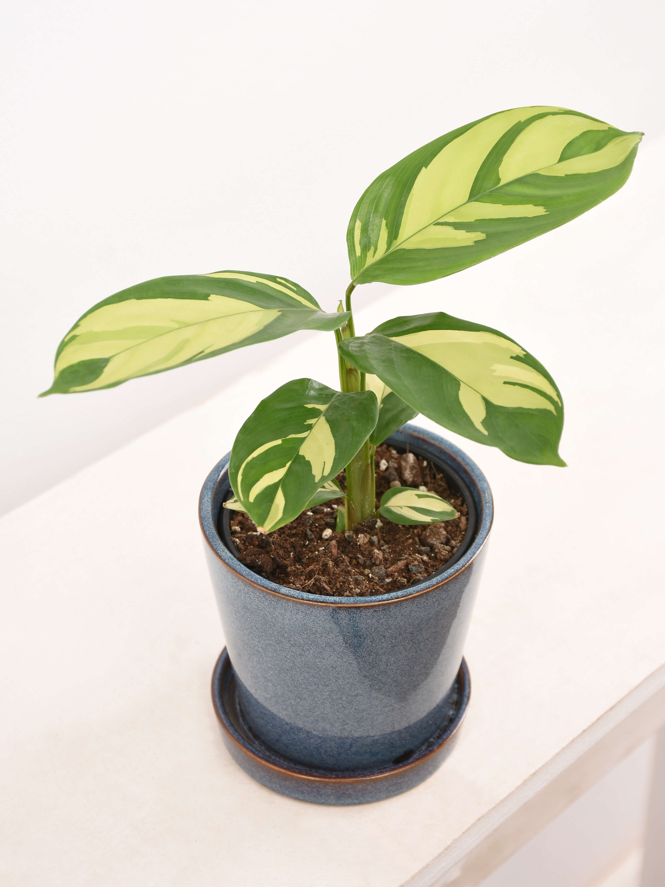
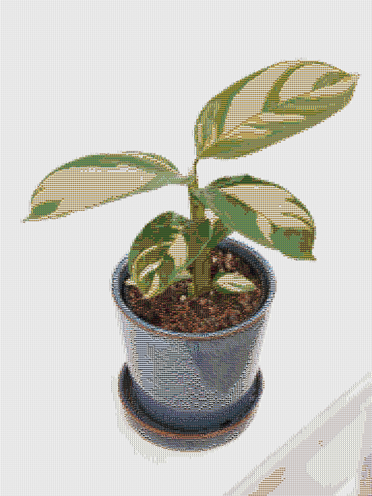

# Mosaic Generator

Create beautiful photo mosaics using a collection of image tiles with this Python script. The script takes a target image, a set of image tiles, and generates a mosaic where each pixel of the target image is replaced by the nearest tile.

## Features

- Import a collection of image tiles.
- Resize tiles to a specified size.
- Generate a photo mosaic from a target image.

## Table of Contents

- [Installation](#installation)
- [Usage](#usage)
- [Examples](#examples)

## Installation

1. **Clone the repository:**

   ```bash
   git clone https://github.com/mahmoudjd/mosaic-generator.git
   cd mosaic-generator
   ```

2. **Install the required dependencies:**

   ```bash
   pip install PySimpleGUI scipy numpy
   ```

## Usage

1. **Prepare your image tiles:**
   Place all your image tiles in a directory.

2. **Run the script:**

   ```bash
   python run.py -i path/to/your/target_image.jpg -o path/to/output_image.jpg -t path/to/your/tiles -x 20 -y 20
   ```

   Replace `path/to/your/target_image.jpg` and other placeholders with the actual paths and dimensions.

## Examples



